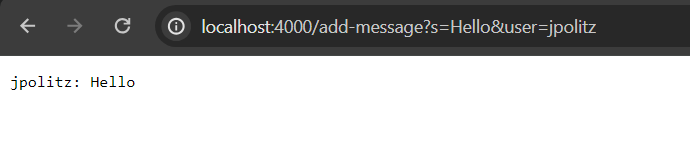
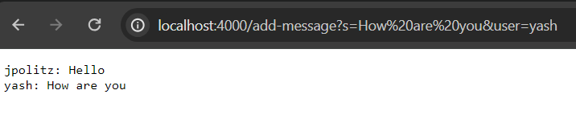
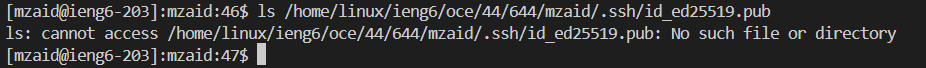
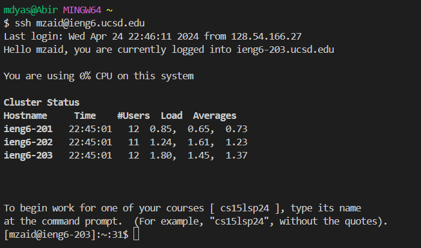

Part 1:

1. The method that was called when I accessed the `URL` `/add-message?s=Hello&user=jpolitz` is the `handleRequest` method in the `Handler` class.
2. The `handleRequest` method takes a `URI` object representing the URL as an argument and uses the `chat` field, a `StringBuilder`, to accumulate chat messages.
3. The `chat` field of the `Handler` class is appended with the new message `jpolitz: Hello\n` as a result of the request `/add-message?s=Hello&user=jpolitz`.

1. The `handleRequest` and `getQueryMap` methods in the `Handler` class are called when the `/add-message?s=How are you&user=yash` command is executed.
2. The `handleRequest` method is called with a `URI` object representing the URL `/add-message?s=How are you&user=yash`, and the chat field of the `Handler` class is used to store and build the chat messages.
3. The chat field of the `Handler` class is appended with the new message `yash: How are you\n` as a result of the request `/add-message?s=How are you&user=yash`.

Part 2:

PRIVATE KEY

PUBLIC KEY

NO PASSWORD LOGIN

Part 3:

There were a lot of things that I have learned from week 2 and week 3 that I never knew before as for example on terminal being able to clone github files and being able to login into the school servers. I also learned how to make my own website and how to edit it properly so that it gives out output the way I want. And lastly, I also learned how to edit the link of my server link and make changes in the server page.
